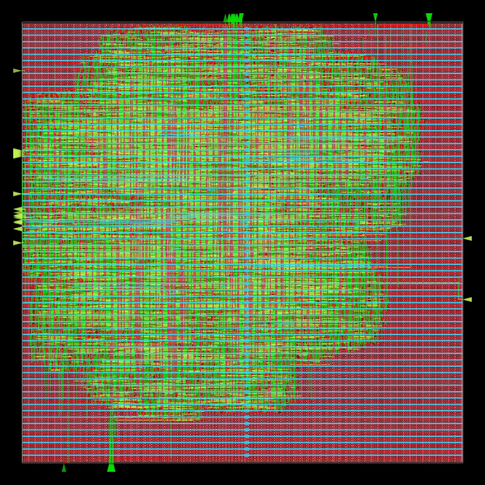
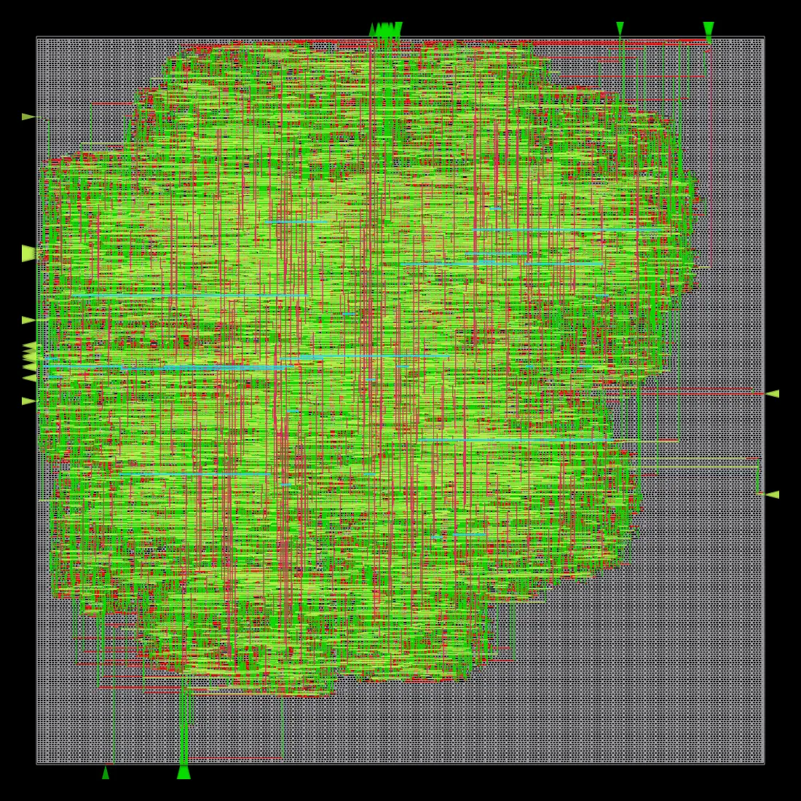
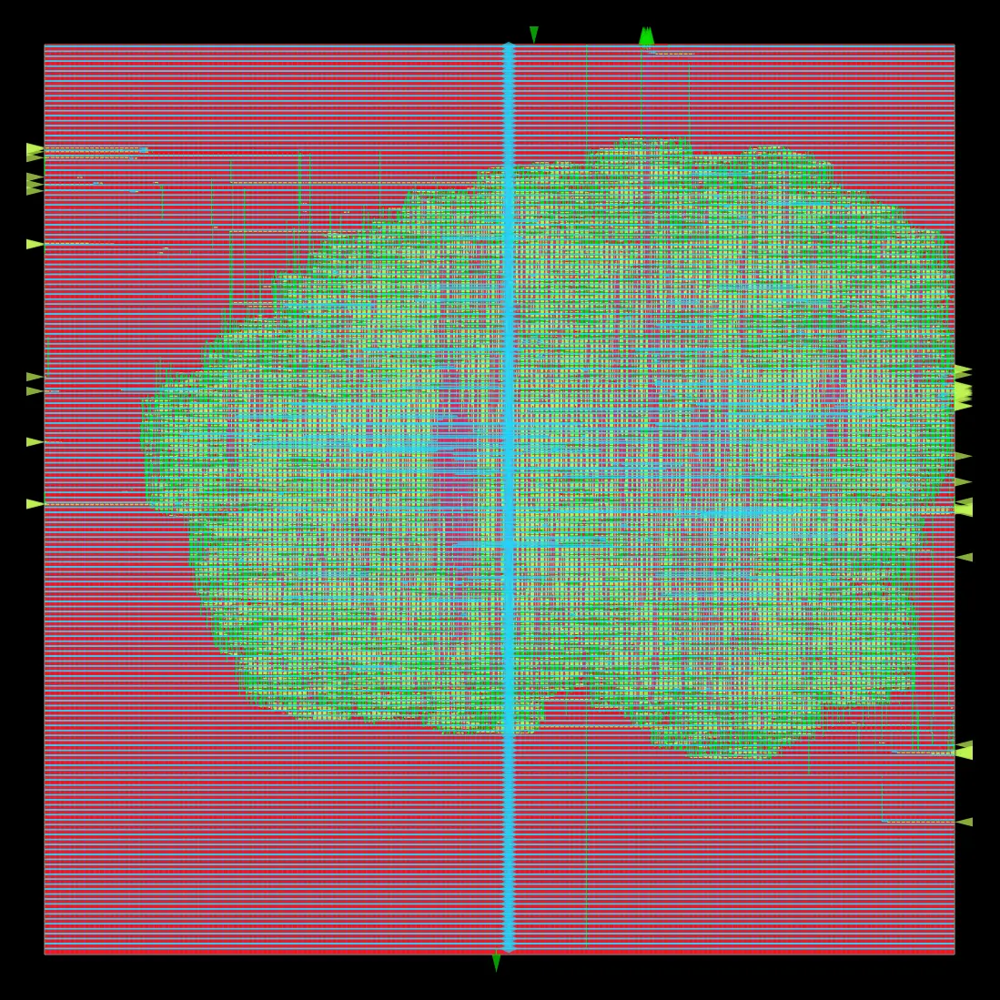
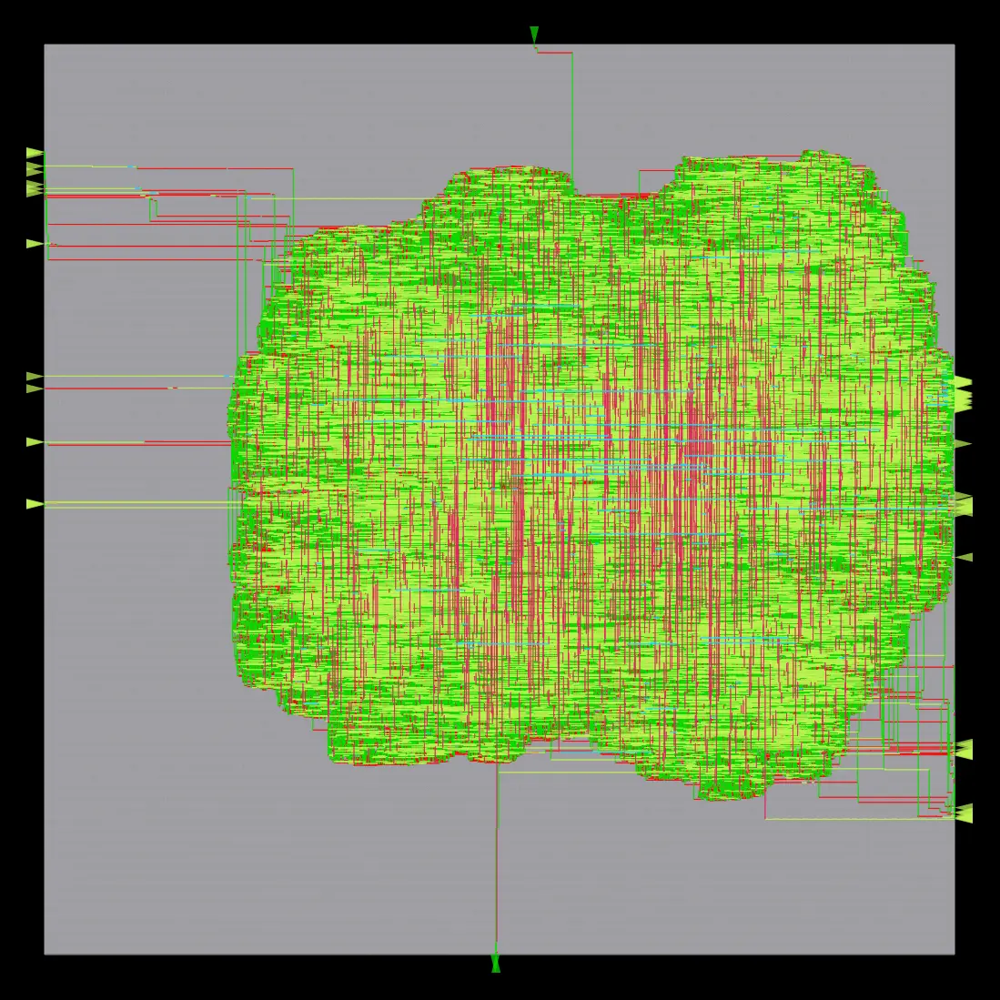

# GDS Gallery

Routed layouts from `tools/harden.sh` (OpenROAD/ORFS, sky130hd). Screenshots are
ORFS's own auto-generated KLayout renders (`harden/reports/.../final_*.webp`),
copied here since the raw GDS/logs/reports tree is gitignored (regenerable,
multi-GB scale — see `harden/HARDEN_RESULTS.md`).

## `khnum_sram_1rw_256x32` — sky130hd

256 x 32 single-port SRAM (read-first), hardened to standard-cell flip-flop RAM
(DFFRAM-style). 374,736 µm², 43% utilization, timing closes at 4.0 ns (WNS
0.00 ns), 0 routing DRC violations. Full numbers: `harden/HARDEN_RESULTS.md`.

### Full routed layout

### Routing detail

## `khnum_sram_1rw_1024x32` — sky130hd

1024 x 32 single-port SRAM, hardened to standard-cell flip-flop RAM.
1,533,880 µm², 25% utilization, timing closes at 6.2 ns (WNS 0.00 ns), 0
routing DRC violations, 0 antenna violations. Took 5 attempts to find a
recipe that both routes cleanly and closes timing — see
`harden/HARDEN_RESULTS.md` for the full iteration history (including a
surprising non-monotonic interaction between clock period and routing
congestion).

### Full routed layout

### Routing detail

